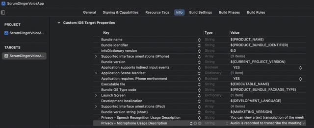

#  Scrum Dinger Voice App  
App keeps track of daily scrums, based on the tutorial by Apple: https://developer.apple.com/tutorials/app-dev-training/getting-started-with-scrumdinger

Here as of 1/21/23: https://developer.apple.com/tutorials/app-dev-training/transcribing-speech-to-text


# Play Custom Audio in App 
First, load the audio file in AVPlayer+Ding.swift as a custom AVPlayer:
```
import Foundation
import AVFoundation

extension AVPlayer {
    /// Initializes an AVPlayer with the ding.wav recording
    static let sharedDingPlayer: AVPlayer = {
        guard let url = Bundle.main.url(forResource: "ding", withExtension: "wav") else { fatalError("Failed to find sound file.") }
        return AVPlayer(url: url)
    }()
}

```
Next, call the audio in a custom closure in the SwiftUI app:
```
    /// Used for the next person's sound
    private var player: AVPlayer { AVPlayer.sharedDingPlayer }
```

Create a custom closure in your view model:
```
/// A closure that is executed when a new attendee begins speaking.
var speakerChangedAction: (() -> Void)?

// Calls the closure in this section of code
if secondsElapsedForSpeaker >= secondsPerSpeaker {
    changeToSpeaker(at: speakerIndex + 1)
    speakerChangedAction?()
}
```

Perform these actions in the closure here.
```
// Call this action as someone's time changes
scrumTimer.speakerChangedAction = {
    // In the closure, seek to time .zero in the audio file, which ensures it plays
    player.seek(to: .zero)
    // Then play the audio file
    player.play()
}         
```

# Persistent Storage
In order to ensure data persists beyond the app start/ shutdown, you can save it to a JSON file in the user's Documents' directory:
```
class ScrumStore: ObservableObject {
    // Any View using this propery will re-render upon change to the property thanks to its WillChange Publisher 
    @Published var scrums: [DailyScrum] = []
    
    /// The app will load/ save changes to it in a JSON file in the Documents folder
    private static func fileURL() throws -> URL {
        try FileManager.default.url(
            for: .documentDirectory,
            in: .userDomainMask,
            appropriateFor: nil,
            create: false
        )
        .appending(path: "scrums.data")
        
    }
    
    // MARK: - Load Scrum Data
    /// Loads the JSON data into the scrums array.
    static func load(completion: @escaping (Result<[DailyScrum], Error>) -> Void) {
        // Loads data with the least priority
        DispatchQueue.global(qos: .background).async {
            do {
                let fileURL = try fileURL()
                // Try creating a file handler for the JSON
                guard let file = try? FileHandle(forReadingFrom: fileURL) else {
                    DispatchQueue.main.async {
                        // If the file does not exist yet, then return an empty array
                        completion(.success([]))
                    }
                    return
                }
                
                // Try decoding the JSON into a local array
                let dailyScrums = try JSONDecoder().decode([DailyScrum].self, from: file.availableData)
                
                // Return a completion handler on the main thread that updates the daily scrums
                completion(.success(dailyScrums))
                
            } catch  {
                DispatchQueue.main.async {
                    // Returns a completion handler with an error here
                    completion(.failure(error))
                }
            }
        }
    }
    
    // MARK: - Save Scrums
    /// Method accepts a completion with the number of saved scrums or an error.
    static func save(scrums: [DailyScrum], completion: @escaping (Result<Int, Error>)->Void) {
        // Handle any encoding errors
        do {
            // Encode the scrums structs into JSON
            let data = try JSONEncoder().encode(scrums)
            // Create a constant for the file being written
            let outfile = try fileURL()
            
            // Write the encoded data to the file
            try data.write(to: outfile)
            
            DispatchQueue.main.async {
                // Pass the number of scrums to the completion handler
                completion(.success(scrums.count))
            }
            
        } catch {
            DispatchQueue.main.async {
                // Catch the error
                completion(.failure(error))
            }
        }
    }
}
```

# Swift 5.5 Async/ Await - Concurrency   
Swift 5.5 introduced new async/ await pattern to more easily call asynchronous code instead of the use of a call-back function
as shown above. 

See the tutorial here for more details: https://developer.apple.com/tutorials/app-dev-training/adopting-swift-concurrency.

However, you can go further, by encapsulating legacy closure-based code with the new async/ await pattern as detailed here:
https://developer.apple.com/tutorials/app-dev-training/modernizing-asynchronous-code

```
static func load() async throws -> [DailyScrum] {
    
    // Suspends the load function, then passes the continuation into a provided closure
    try await withCheckedThrowingContinuation({ continuation in
        // Call the legacy load reference
        load { result in
            // Switch on the two types of results returned
            switch result {
            case .failure(let error):
                // Send the error to the continuation closure
                continuation.resume(throwing: error)
                
            case .success(let scrums):
                continuation.resume(returning: scrums)
            }
        }
    })
}

// MARK: - Load Scrum Data
/// Loads the JSON data into the scrums array.
static func load(completion: @escaping (Result<[DailyScrum], Error>) -> Void) {
    // Loads data with the least priority
    DispatchQueue.global(qos: .background).async {
        do {
            let fileURL = try fileURL()
            // Try creating a file handler for the JSON
            guard let file = try? FileHandle(forReadingFrom: fileURL) else {
                DispatchQueue.main.async {
                    // If the file does not exist yet, then return an empty array
                    completion(.success([]))
                }
                return
            }
            
            // Try decoding the JSON into a local array
            let dailyScrums = try JSONDecoder().decode([DailyScrum].self, from: file.availableData)
            
            // Return a completion handler on the main thread that updates the daily scrums
            completion(.success(dailyScrums))
            
        } catch  {
            DispatchQueue.main.async {
                // Returns a completion handler with an error here
                completion(.failure(error))
            }
        }
    }
}
```

# Accessing App's Sandbox to Produce an Error
https://developer.apple.com/tutorials/app-dev-training/handling-errors
Each app upon installation gets loaded into its own sandbox. You can access the sandbox with the help of your 
product identifier found under the build instruction that looks like `yourName.ScrumDingerVoiceApp`. Note this value,
then launch a terminal window and run:
```
xcrun simctl get_app_container booted com.example.apple-samplecode.Scrumdinger data
```
Copy the path it produces, then use it to open a new Finder window at that location:
```
open -a Finder pastedPath
```
From here, open the data under the `Documents` folder, and delete one of the IDs in order to intentionally corrupt
the data. 

App produces the following error:


# Transcribing Meetings
In order to access the device's microphone, you must ask the user for permission. This tutorial details 
how to accomplish this: https://developer.apple.com/tutorials/app-dev-training/transcribing-speech-to-text. 




